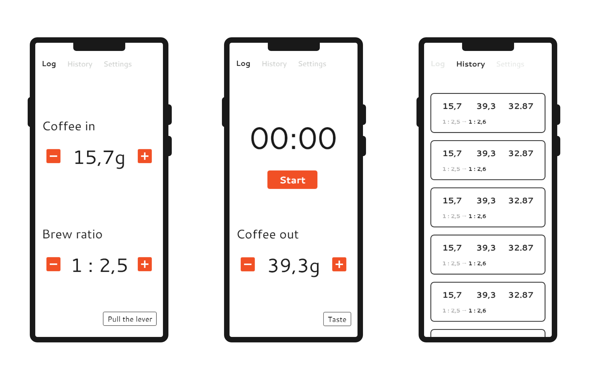

# Bean it

## The idea

Because so many variables go into making an enjoyable espresso shot, I weigh out my beans, the yield of espresso and I take the time of the shots. Later you make adjustments based on taste and metrics like the time it took the espresso to run through the ground beans to improve the taste of the espresso. Being a developer I love looking at stats and data. Therefore I looked into solutions of digitally collecting those information. Soon I stumbled over the [Acaia Lunar Scale](https://acaia.co/products/lunar) which tracks all the information and presents it nicely in a app. But looking at the price, I thought "I could do that".

## First sketches

As with every idea, I jumped into my prototyping tool of choice (Adobe XD) and started making some sketches for the structure and design of the app. I went with a very simple tabbed layout and very few functions at the beginning (measure and log overview).

## Development

I chose to develop this app in Android as I did'nt program any app in a long time and it was a good fit for a small weekend project. Also, later it payed off, as accessing device sensors is way easier in a native app than in a web app.

For the structure of the app, I opted for a single activity with multiple fragments that are controlled by a ViewPager. The data is stored using the Room-model of Android. Further, i am using the MVVM (**M**odel, **V**iew, **V**iew-**M**odel) approach to present and update the underlying data. During development this made it very easy to adapt and add new features. Overall i enjoyed using Room and the MVVM approach eventhough it takes some time getting used to it.

## Fancy features

After some first usages of the app in my daily coffee routine, I recognized that it is a huge hustle of doing all the steps to brew a coffee and simultanously enter weights and start and stop a timer. After looking into building my own remote scale (like the Lunar) with an Arduino, I quickly discarded this idea.
After thinking some more I came across the idea to use the microphones of the phone to recognize when the pump of the espresso machine is running and when it is not, to automatically start and stop the timer. However this turned out to be rather complex and not very consistent if people are talking in the room at the same time.

My next approach was to use the gyroscope of the phone to detect vibrations of the espresso machine. This came in handy as I was laying my phone on top of the machine anyways. I spend quite some fiddling around with the equation to emphasize vibration enough over minor noise in the data to be able to set a threshold when the timer should start and when it should stop.

The next problem was that flipping the lever at the beginning or bumping the kitchen counter was triggering the timer shortly and it wouldn't run again afterwards or would run to long, when the espresso machine keeps pumping water after brewing to refill the boiler. That is the reason why I ended up implementing that the timer could start and stop as often as it likes in the beginning (to account for small bumps), but wouldn't start again after it reached 15 seconds. The amount of 15 seconds is arbitrary in this case, but I figured that this is the amount you would want your extraction last at least (aiming usually for around 25 - 35 seconds).

## Conclusions

### Daily Use

Since I developed the app, I use it for nearly all my extractions as it gives a nice overview of your last settings and how the shot went. I also use it to keep track of my daily coffee consumption.

### Possible extension

Features I'd like to work on in the future are:

1. Implement tasting metrics after pulling the shot to rate the recipe
1. More data analysis (Average consumption, cleaning reminders, etc.)
1. Saving of recipes and used beans to quickly pull up good settings from the past
1. Automatic recommendations for grinder adjustments (based on tasting metrics).
1. Remote storage for access from other devices / services (e.g. Home Assistant integration for cleaning reminders)

If you like the project and you are a coffee lover yourself, you can find all the code on GitHub. I am open for any questions anytime, just hit me up ☕.
