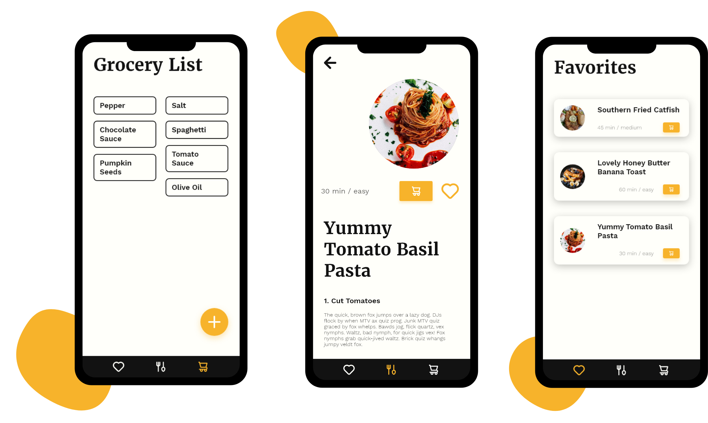

## Planning and Ideation

### Basic Conditions

Because this project was created during our app development course, our lecturer set a couple of requirements.
We were allowed to select five and decided to incorporate the following in our project:

1. API
1. Master-Detail view
1. User preferences
1. Data persistency
1. Geo services

### Finding an Idea

We chose to use the design thinking method to come up with a feasible idea.
Design thinking was introduced to us during another lecture around the topic of "Agile Planning and Implementation".
We felt this project is a good candidate to apply the method.
As a team we agreed to look into the field of "food, cooking and taste", because all of us are passionate about this topic.

After an initial brainstorming, we recognized that a shared problem is eating similar meals over and over again due to lack of inspiration and time after a long day.
After further iteration, we settled on developing an app that would suggest up to five random recipes triggered by leaving a predefined geo fence (e.g. university or office).
Users should be notified after leaving a the place to choose from a refined list of recipes and easily create a shopping list to pick up the required ingredients on their way home.

## Prototyping

As soon as we finalized our ideation, we began prototyping in Adobe XD.
We tested various designs and feature combinations.
Our final set of features included:

- Recipe suggestions / discovery
- Favorites list
- Shopping list to simplify grocery shopping
- User preferences (e.g. dietary preferences)

## Technology

As a data source for fetching the recipes we decided to use [Spoonacular](https://spoonacular.com/food-api).
The API provides a rich collection of different recipes, which can be filtered by dietary restrictions and include detailed ingredient lists.
Because recipes would only be updated once a day, we cached received recipe data to save network bandwith and improve performance.
For local storage we opted to use the [Android "Room" convenience layer](https://developer.android.com/training/data-storage/room), which is built around SQLite and tied nicely into the remaining architecture of the application.

We used Android's Model, View, View-Mdel approach to handle and display our data.
One of the main benefits was that view models have their own lifecycle and can persist state.
An example for this is keeping current user input in form elements even when the view's lifecycle updates, for example, due to a rotation of the device.

Further, we build our navigation using the Android X navigation components.
Including the navigation graph, transitions and motion layout.
We enjoyed using those concepts, because it heavily simplified building a nice User Interface with good looking transitions.

## Team Organization

We used reduced Scrum process to facilitate our collaboration.
Choosing a sprint length of one week with standups every other day and a joint review at the end of every week turned out to be good fit for our team and the project.
The regular sync meetings allowed us to coordinate our work efficiently and help each other when encountering problems.
The joint review helped us in appreciating our progress.

## Conclusions

All of us were very satisfied with what we created (not just because it resulted in a very good grade 🥳).
We learned a lot about app development in Android and thoroughly enjoyed the process of taking an idea to concrete implementation.
While overcoming technical hurdles, we also learned what it means to properly collaborate on a codebase, to implement good architecture and use mutual reviews to assure code quality.
