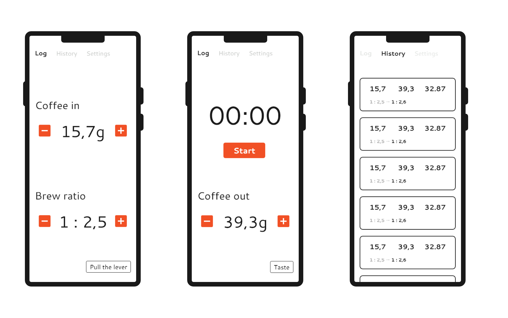

## The Idea

Many variables go into making an enjoyable espresso shot:

- Grinder setting (coarseness)
- Coffee weight (in)
- Water temperature
- Extraction time
- Espresso weight (out)
- ...

Based on taste, one makes adjustments to some of the variables above.
Mainly the grinder settings and brew ratio.
I love looking at stats and data to take data-driven decisions.
Therefore I looked into solutions of collecting those information digitally.
Soon I stumbled over the [Acaia Lunar Scale](https://acaia.co/products/lunar_2021) which tracks all the information and presents it nicely in a mobile app.
After looking at the price of the scale, a new project with the "I can do that myself" dogma was born.

## First Sketches

I jumped into my prototyping tool of choice during the time: Adobe XD and started creating first sketches for the structure and design of the app.
I went with a very simple tabbed layout and limited functionality for the beginning:

1. Page for taking a new measurement
1. Overview of recent measurements
1. Settings

## Development

I chose to develop this app in Android as I did not program an app for quite some time.
I saw this project as a good candidate to familiarize myself further with the new Android X libraries.

For the structure of the app, I opted for a single activity with multiple fragments that are controlled by a `ViewPager`.
Using the MVVM (**M**odel, **V**iew, **V**iew-**M**odel) approach to present and update the underlying data made it very easy to adapt and add new features.
The data is stored using [Android's Room model](https://developer.android.com/training/data-storage/room), because no remote data storage was necessary for the initial scope.
Overall I enjoyed using the new libariries and felt that they took away some of the pain I had in mind from developing Android apps previously.

## Re-Iterating

After using the app for some time in my daily coffee routine, I felt that doing all the steps to brew a coffee and simultanously entering weights and starting / stopping a timer is inconvenient.
I began looking into building my own remote scale (like the Lunar) with an Arduino, however quickly discarded this idea.
Exploring futher options, I came across the idea to use the phone's microphone to recognize when the pump of the espresso machine is running to automatically start / stop the timer.
However, this turned out to be rather complex and not very consistent.
The main problem being ambient noise.
For exmaple, people talking, music playing, etc.

My next approach was to use the phone's gyroscope sensor to detect vibrations of the espresso machine.
This option seemed more viable, as external influences were lower compared to the noise approach and I was laying my phone on the countertop anyway to enter the remaining data.
After fiddling around with the equation to emphasize actual vibration over random signal noise, I got this approach to work to automatically start / stop the timer based on a vibration threshold.

The next problem I encountered was that flipping the lever or bumping the kitchen counter was triggering the timer briefly and it would not run again afterwards.
Additionally, the timer would continue running, when the espresso machine kept pumping water to refill its boiler.
As a workaround, I implemented that the timer could start / stop arbitrarily often during the first 15 seconds to account for accidental bumps.
This time window was chosen arbitrarily, but I figured that one usually aims for an extraction time of around 25 - 35 seconds, making 15 seconds a reasonable choice.

## Conclusions

Since developing the app, I use it for nearly all my extractions as it gives a nice overview of your last settings and how the shot went.
I also use it to keep track of my daily coffee consumption.

> EDIT: I stopped using the app at some point and replaced it with a hardware-based espresso timer that was fixed to my espresso machine.
> It's using the same approach of sensing vibration to start the timer.
> Find more details about it in the [ESP-8266 Coffee Timer project post](/en/projects/esp8266-coffee-timer).

Features I would like to work on in the future are:

1. Implement tasting metrics after pulling the shot to rate the recipe
1. More data analysis (Average consumption, cleaning reminders, etc.)
1. Saving recipes for certain beans
1. Automatic recommendations for grinder adjustments (based on tasting metrics).
1. Remote storage for access from other devices / services (for exmaple, integrating with Home Assistant)

If you like the project and you are a coffee lover yourself, you can find all the [code on GitHub](https://github.com/failllix/espresso-tracker).
I am open for questions anytime, feel free to reach out ☕.
