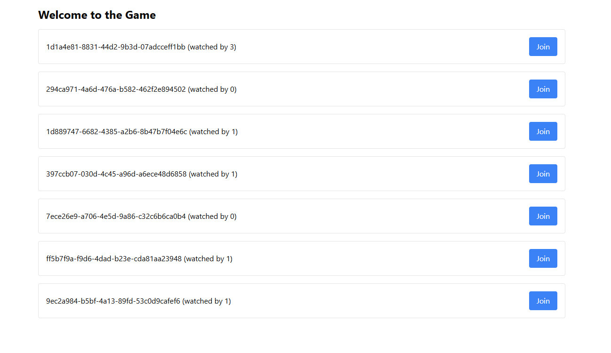

## Idea and Motivation

[Felix](https://www.linkedin.com/in/felix-gerberding/) and I enjoyed participating in hackathons during our studies.
We loved tinkering with problems in a limited time with the goal of creating a solution, mostly in the form of prototypes.
After transitioning to our full-time jobs, we did not join any hackathons, however missed that experience.
So, the two of us decided to take a weekend and work on project in a hackathon-style.
We mentioned this in our friend group, which sparked interest in others and as a consequence our plan of a weekend project transitioned to organizing a small hackathon.

### Project Requirements

We quickly recognized that we would have to consider a couple of facts when designing a topic or challenge for the hackathon:

- Participants are not co-located; can only meet virtually
- Different programming skill levels
- Differnet preferences for programming languages and topics (e.g. data science, backend development, full-stack development, etc.)
- All of us were interested in coding, not just creating slides or click dummies

Based on the facts above, we concluded the following requirements that our project should fulfill:

1. Remote access
1. Implementation focused
1. Language agnostic impementation must be possible
1. Simplicity
1. Competitive nature

### Project Description

Given the requirements above, we set out to build a multiplayer online game.
Our idea for the hackathon project was that everyone would implement a control algorithm to decide what their player should do next.
The rules of the game were supposed to be simple, while allowing for enough complexity to make the game interesting and the control algorithm not too simple.

We ended up with a simple 2D arena made up of tiles and players that had the following options:

- Move (left, right, up, and down)
- Rotate (0-360°)
- Shoot

The game would be turn-based, so that a player must choose from one of those actions each turn.
That means it would not be possible to move and rotate within the same turn.
Hitting other players would deduct 20 health points, meaning that after 5 hits one is disqualified from the round.
We opted for a non-hitscan mechanism for calculating hits, so that players could dodge projectiles flying their way.

To develop and test clients in isolation we also figured that multiple lobbies should be able to exist.
Participants should be able to create their own lobbies.
We did not implement any authorization system to limit who would be able to see, create, start, delete which lobbies.
This also meant it was possible to spectate any lobby at any time.
In theory you could spy on what your opponents strategy looks like.
We figured that a full fledged authorization concept was not necessary in our "trusted environment" of participants and would only add extra complexity and development efforts in the preparation phase.
In general, and especially when running such a project with untrusted clients or participants, some form of authorization would be advised.

## Technology

Deciding for a game as the basis for the hackathon project also meant that we would have implement the game server and visualization client before the event.
[Felix](https://www.linkedin.com/in/felix-gerberding/) and I decided to split development efforts into frontend and backend.
I would be responsible for the backend service, while [Felix](https://www.linkedin.com/in/felix-gerberding/) would handle the visualization of what was going on in a lobby.

### Backend

I chose Rust for the backend impementation.
For no particular reason except never having used Rust before and wanting to give it a try for quiete some time.

After some discussion we agreed to split the backend into two parts:

1. A management API to control lobbies
1. Websocket-based communication for clients to connect to lobbies and interact with the game

> **Hint:** Checkout out the [Management API documentation](https://github.com/failllix/mca-hackathon-2024/blob/main/docs/management-api/README.md) to learn more of the capabilities and concrete requests.
> The [Flow of Information document](https://github.com/failllix/mca-hackathon-2024/blob/main/docs/game-server/README.md) contains details about the communication between clients and server and provides details for the JSON-based messages.

As mentioned above, this was my first time programming with Rust.
It was more or less also my first time using a rather low-level language to implement a full project.
While liking the Rust ecosystem as such, I was also pretty annoyed from time to time by some of the compiler errors.
Part of that was also caused by choosing asynchronous handling to process messages and requests.
Having to be careful about what is running in a thread when and which data must be shared (and locked) across threads definitely added some complexity that I would try to avoid next time when jumping into a new language.
At the same time, I think that I had to troubleshoot issues that I would have not seen otherwise, which was a great learning opportunity.

The server turned out to be very capable of handling several lobbies at the same time and processed messages very quickly.
I guess that's the reward after fighting your way through undescriptive compiler errors.
We observed local response times of around 20ms using a browser-based client and response times around 0ms to 1ms with a Node.js client.
We never gave the server a full load test, but never felt that it is any sort of bottleneck.

### Frontend

The frontend was built using [React](https://react.dev/), [tailwind CSS](https://tailwindcss.com/) and [vite](https://vite.dev/).
The frontend client provides an overview of lobbies, how many spectators are watching a lobby and the opportunity to start spectating a lobby.

After entering a lobby the frontend would provide an overview of players, their health points, position and rotation.
The frontend would receive the same messages as all other clients in the lobby for visualization.
Drawing the grid, players and projectiles was done using plain SVG paths.
Animations were added using [Motion](https://motion.dev/).

<video autoplay loop>
  <source src="/projects/mca_hackathon_2024_demo.mp4" type="video/mp4" />
  Your browser does not support the video tag.
</video>

## Summary

Now that the event is over, this section will discuss what we liked and points we think need improvement.

### What Went Well

Our initial plan of taking a weekend and working fully focused on some project worked out great (and we got quiete some time of working together in advance to prepare the project and event).
Sharing this experience with others, seeing different ideas emerge and bouncing thoughts back and forth made it even greater.

Most of us took an algorithmic approach with minor differences.
Nearly all of us recognized that it is very effective to dodge incoming bullets.
However, when and how the client would shoot differed among participants.

Opposing the deterministic algorithmic approaches, one participants chose a Convolutional Neural Network (CNN) with a reward function to tackle the challenge.
It would be trained by having several bots fight themselves and using an evolutionary algorithms to keep positive traits of the current population.
The Deep Neural Network was never able to perform on a similar level compared to the other clients, which was likely caused by a flawed reward function.

Personally speaking I was quite pleased with the client I have developed.
It performed well during the hackathon, but is not perfect.
The algorithm / library I was using for path drawing (calculating which fields would be hit by a projectile) is not the same as the one on the server.
Because they produce slightly different results, the prediction and thus dodging of projectiles does not work all the time, but it turned out to be good enough.
You can find all of my code on [GitHub](https://github.com/failllix/mca-hackathon-2024-client).

### What we Would do Differently Next Time

The biggest area for improvement we saw was too little complexity in the game and lacking balancing of defensive vs. offensive strategies.
Caused by the limited movement speed of projectiles, clients were able to dodge all incoming projectiles, leading to infinite duels without any hits.
Once most clients were sophisticated enough to evade incoming threats, most rounds ended in a draw.

To avoid this in the future we would focus on two points:

1. Play testing the game more strongly in advance to identify balancing issues
1. Adding more complexity

We tried to avoid play testing the game prior to the event to not gain an unfair advantage.
Sadly this resulted in identifying issues with the core gameplay too late.

To add more complexity to the game, we thought of the following possible extensions afterwards:

- Shrinking the arena over time
- Spawning powerups in the arena
- Having limited superpowers per client (e.g., double damage, moving several fields at once, etc.)
