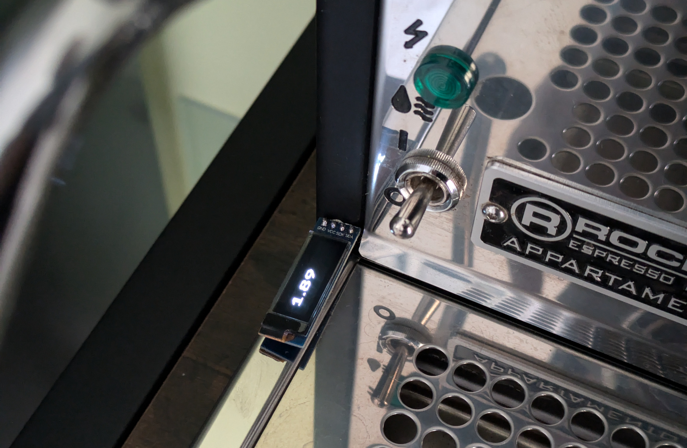

This project followed my ["Bean it" project](/projects/bean-it).
My initial aspiration to track each and every shot of espresso died down at some point.
Additionally, I found it increasingly annoying to get my phone out whenever I desired a coffee.

Nonetheless, I am convinced that extraction duration is a good indicator whether you are pulling a good shot of espresso.
So checking it from time to time makes sense.
I also still liked the idea of automatically starting a timer when the espresso machine starts pumping.

Born was the project idea to take the vibration activated timer of the ["Bean it" app](/projects/bean-it) and to put that into a small, dedicated device.
I ended up using a Wemos D1 Mini, a small OLED display and a gyroscope (vibration sensor) to realize it.
The final outcome looked liked the following and did nothing else than (re)starting the timer whenever the pump of the espresso started running:

All of the electronics are pictured below.
The vibration sensor was zip-tied to the espresso machine to ensure it would pick up all vibrations.
The Wemos D1 Mini was nicely tucked beneath the espresso machine.
For reference: I ran used the setup with a "Rocket Appartamento" machine.

